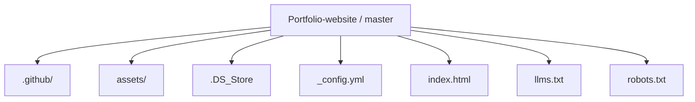
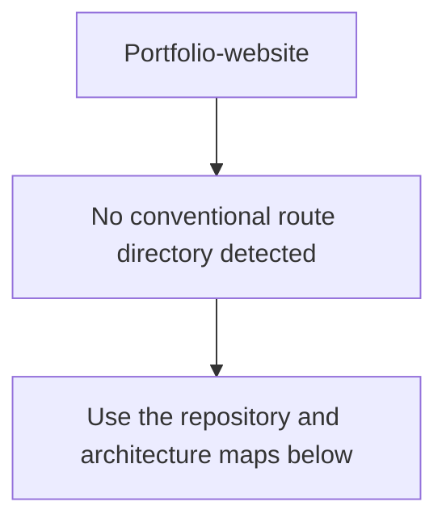
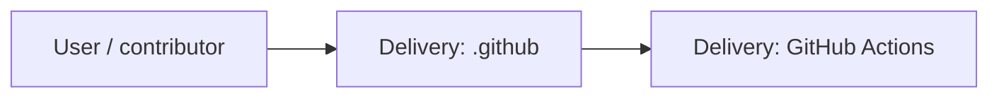
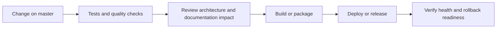
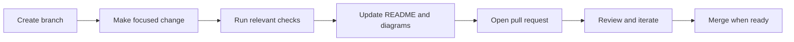

<!-- interactive-readme-standard:start -->

<div align="center">

# Portfolio-website

**Branch-aware technical guide for [`master`](https://github.com/Nischhalsubba/Portfolio-website/tree/master)**

<p>    </p>

<p>
  <a href="https://github.com/Nischhalsubba/Portfolio-website/tree/master"><strong>Browse source</strong></a> ·
  <a href="https://github.com/Nischhalsubba/Portfolio-website/issues"><strong>Issues</strong></a> ·
  <a href="https://github.com/Nischhalsubba/Portfolio-website/codespaces/new?ref=master"><strong>Open in Codespaces</strong></a>
</p>

</div>

> [!IMPORTANT]
> This guide is generated from the files actually present on `master`. It links to detected source paths, preserves project-authored notes, and avoids claiming components that were not found.

## At a glance

| Item | Detected value |
|---|---|
| Purpose | A JavaScript project documented from the current branch structure and manifests. |
| Branch role | Default branch |
| Stack | JavaScript, CSS, HTML |
| Manifests | No standard manifest detected |
| Prerequisites | Confirm from the detected manifests |
| Delivery | GitHub Actions |
| License | No license file detected |

## Branch scope

This is the repository's default branch.


## Quick start

> No reliable setup command was detected. Use the preserved project-authored notes and manifests rather than guessing.

### Configuration surface

- No committed environment example file was detected.

> Never commit secrets, private keys, production credentials, customer data, or unredacted infrastructure details.

## Repository map



| Responsibility | Detected source paths |
|---|---|
| Delivery | [`.github`](https://github.com/Nischhalsubba/Portfolio-website/tree/master/.github) |

## Website or application map



## Architecture and responsibility flow




## Quality, security, and operations

<table>
<tr>
<td width="33%" valign="top">

### Quality

- No conventional test directory was detected automatically.

Detected commands:
- No standard quality command detected.

</td>
<td width="33%" valign="top">

### Security

- No dedicated security policy or automated dependency configuration was detected.

Review authentication, authorization, input validation, dependency updates, secret handling, and failure recovery before release.

</td>
<td width="34%" valign="top">

### Observability

- No dedicated observability integration was detected automatically.

Define useful logs, metrics, traces, alerts, and rollback signals for production-facing branches.

</td>
</tr>
</table>

## Delivery flow



### Automation detected

- [`.github/workflows/apply-interactive-readme.yml`](https://github.com/Nischhalsubba/Portfolio-website/blob/master/.github/workflows/apply-interactive-readme.yml)

## Contribution flow



- Keep changes focused and explain architectural consequences.
- Run the checks relevant to the changed area.
- Update diagrams whenever routes, modules, data models, authentication, jobs, or delivery paths change.
- Add screenshots or recordings for visual behavior changes when useful.
- Use issues for reproducible defects and pull requests for reviewable changes.

## Ownership and support

| Topic | Source |
|---|---|
| Repository | [`Nischhalsubba/Portfolio-website`](https://github.com/Nischhalsubba/Portfolio-website) |
| Branch | [`master`](https://github.com/Nischhalsubba/Portfolio-website/tree/master) |
| Ownership | No CODEOWNERS file detected |
| Contributing | Use the contribution flow above |
| Support | [Open or review issues](https://github.com/Nischhalsubba/Portfolio-website/issues) |
| License | No license file detected |

<details>
<summary><strong>Documentation maintenance checklist</strong></summary>

- [ ] Purpose and branch scope are accurate.
- [ ] Setup and configuration commands still work.
- [ ] Repository, application, API, data, authentication, job, and deployment diagrams match the code.
- [ ] Tests, security controls, observability, and rollback behavior are documented.
- [ ] Links point to real files on this branch.
- [ ] No secrets or private operational details are exposed.

</details>

<!-- interactive-readme-standard:end -->

<!-- project-authored-notes:start -->
<details>
<summary><strong>Project-authored notes preserved from this branch</strong></summary>

<div align="center">

# Nischhal Portfolio Website

### Static Personal Portfolio Landing Page

**A classic one-page personal portfolio website for Nischhal Subba, built with HTML, CSS, Bootstrap, JavaScript, Line Icons, Magnific Popup, parallax hero shapes, skill bars, portfolio lightbox, blog cards, contact form, and smooth section navigation.**


</div>

---

## ✨ Overview

**Portfolio-website** is an older static personal portfolio website for **Nischhal Subba**. It introduces Nischhal as a UI Designer and Web Developer and includes sections for hero, about, services, call-to-action, portfolio works, blog previews, contact details, contact form, and footer.

The site is built with traditional frontend technologies and uses Bootstrap for responsive layout, Line Icons for iconography, Magnific Popup for portfolio previews, and JavaScript plugins for interaction behaviors such as preloader, parallax, smooth scroll, counters, and image popups.

---

## 🧭 Table of Contents

- [Project Purpose](#-project-purpose)
- [Designer’s Perspective](#-designers-perspective)
- [Page Sections](#-page-sections)
- [Features](#-features)
- [Tech Stack](#-tech-stack)
- [Run Locally](#-run-locally)
- [Deployment](#-deployment)
- [Quality Checklist](#-quality-checklist)
- [Modernization Roadmap](#-modernization-roadmap)

---

## 🎯 Project Purpose

The purpose of this repo is to present a personal portfolio landing page with a classic one-page structure.

The site helps visitors quickly see:

- who Nischhal is
- what services he offers
- his basic skill areas
- selected work previews
- blog/article preview cards
- contact information
- social links

---

## 🎨 Designer’s Perspective

This project reflects an earlier portfolio direction. It is useful as a learning and evolution marker because it shows the transition from basic UI/web developer portfolio layouts toward more mature product-design portfolio systems.

From a design perspective, the page focuses on approachable personal branding, section-based navigation, visual hero composition, service cards, skill progress indicators, project image previews, and direct contact CTA.

---

## 🧱 Page Sections

| Section | Purpose |
|---|---|
| Preloader | Initial loading animation |
| Header / Hero | Intro, title, social icons, parallax shapes, CTA |
| About | Bio, contact details, skill bars |
| Services | Web design, graphic design, app design, illustration, web development, support |
| Call to Action | Download CV / hire-me style prompt |
| Work | Portfolio image grid with lightbox preview |
| Blog | Three blog preview cards |
| Contact | Address, phone, email, form, embedded map |
| Footer | Logo, short bio, social links, copyright |

---

## 🌟 Features

| Feature | Description |
|---|---|
| One-page navigation | Smooth section-based portfolio flow |
| Responsive Bootstrap grid | Adapts across desktop and mobile layouts |
| Parallax hero shapes | Decorative layered hero animation direction |
| Skill bars | Visual skill percentage indicators |
| Portfolio lightbox | Magnific Popup image preview behavior |
| Blog cards | Static article preview cards |
| Contact form | Form connected to `assets/contact.php` path |
| Embedded map | Google Maps iframe in contact section |
| Social links | Header and footer social icon areas |

---

## 🛠 Tech Stack

| Layer | Technology | Purpose |
|---|---|---|
| Markup | HTML5 | Static portfolio structure |
| Styling | CSS | Visual theme and layout styling |
| Framework | Bootstrap | Grid and responsive layout |
| Icons | Line Icons | Service/contact/social icons |
| Lightbox | Magnific Popup | Portfolio image preview |
| JavaScript | jQuery / plugin scripts | Interactions, preloader, scrolling, popup, counters |

---

## 🚀 Run Locally

No build step is required. Open `index.html` directly in a browser or run a static server:

```bash
python -m http.server 8000
```

Then open:

```text
http://127.0.0.1:8000/
```

---

## 🌐 Deployment

This site can be deployed to GitHub Pages, Netlify, Vercel, Cloudflare Pages, or shared hosting.

Keep the `assets/` folder structure unchanged so CSS, JS, images, and form paths continue to work.

---

## ✅ Quality Checklist

### Design QA

- [ ] Replace placeholder service copy.
- [ ] Replace generic work images with real portfolio projects.
- [ ] Update bio and role positioning.
- [ ] Update contact details if public.
- [ ] Ensure hero is readable on mobile.
- [ ] Check spacing across all sections.

### Technical QA

- [ ] `index.html` loads correctly.
- [ ] Bootstrap styles load.
- [ ] Magnific Popup works.
- [ ] Skill bars animate correctly.
- [ ] Contact form path is valid or updated.
- [ ] Embedded map location is correct.
- [ ] No broken image paths.

---

## 🗺 Modernization Roadmap

- Replace outdated personal details with current professional positioning.
- Add real case-study links.
- Add SEO meta description and Open Graph tags.
- Add accessible alt text for all images.
- Replace placeholder social links.
- Add updated resume link.
- Convert to a modern static/Vite setup if active maintenance is needed.
- Improve responsive typography and mobile nav polish.

---

<div align="center">

An early personal portfolio website showing the foundation of Nischhal’s design and frontend journey.

</div>

</details>
<!-- project-authored-notes:end -->
