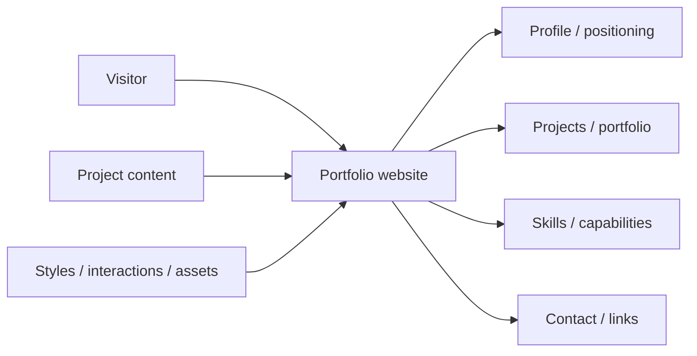
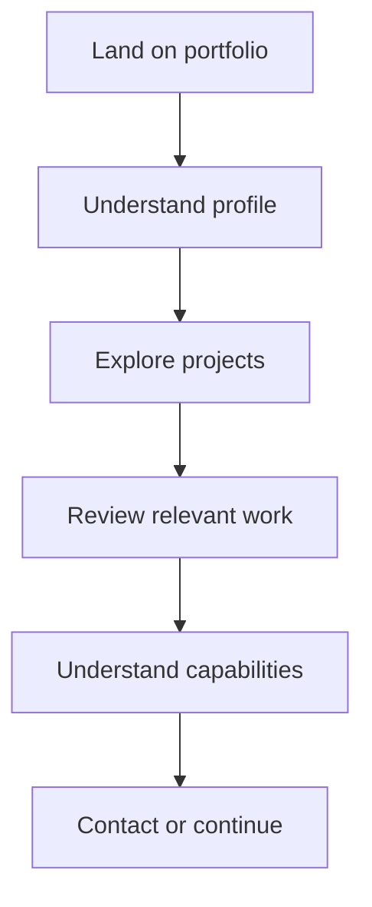
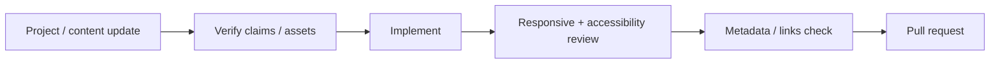

<div align="center">

# Portfolio Website

**A responsive portfolio website project for presenting work, skills, profile information, and contact paths with a clear visual and content hierarchy.**


[Browse source](https://github.com/Nischhalsubba/Portfolio-website/tree/master) · [Issues](https://github.com/Nischhalsubba/Portfolio-website/issues)

</div>

## Overview

**Portfolio Website** is documented around a simple visitor goal: understand the person and their work quickly, inspect relevant projects or capabilities, and reach a useful contact or external link without wandering through decorative archaeology.

<details open>
<summary><strong>🏗️ Interactive portfolio architecture</strong></summary>



</details>

## Visitor flow



## Getting started

```bash
git clone https://github.com/Nischhalsubba/Portfolio-website.git
cd Portfolio-website
```

Use the project files and manifests to determine the current runtime and development commands.

## Design & accessibility

Preserve meaningful project context, readable typography, responsive layouts, visible focus, keyboard navigation, useful image alt text, and restrained motion. Visual polish should support understanding rather than compete with the work.

## SEO & discoverability

Use accurate role, portfolio, skill, and project terms in natural visible copy. Maintain unique titles/descriptions, semantic headings, descriptive project URLs and links, canonical metadata, Open Graph previews, and structured Person/CreativeWork data when useful.

## Contribution flow


